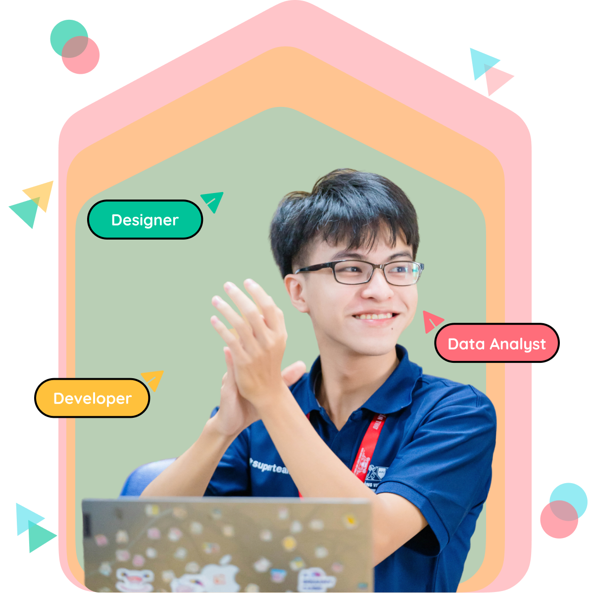

# Hi, I'm Jay Andy! 👋

## 🔗 Links to my social profile

**🌞 Tran Phu Dat - Aka: Jay Andy**
## 🚀 About Me
- I'm full-stack developer based in Ho Chi Minh city, Vietnam.
  
-<kbd>

</kbd>-

## 🤓 My Stats

<!---
TranDat1114/TranDat1114 is a ✨ special ✨ repository because its `README.md` (this file) appears on your GitHub profile.
You can click the Preview link to take a look at your changes.
--->
## 🛠 Skills

#### I can using
- **Tool:**
    + Github
    + Azure / AWS
    + Figma / Adobe Illustrator
    + Postman / Swagger / Scalar
    + Docker
    + Kubernetes
    + Jenkins + Nginx
    + RabbitMQ
    + Elastic Search
    + Kibana
          
- **Technology:**
    + C#:
        + WPF / Winform (Desktop Application)
        + ASP.Net Core (Web Application; Backend)
        + Blazor Wasm / Razor Page (Web Application; Frontend)
    + Typescript:
        + NextJs (Web Application;)
        + Angular (Web Application;)
    + Css:
        + TailwindCss / Boostrap (Web Application;)
- **Relational Database:**
    + Microsoft Sql Server
    + Sql Lite
    + PostgresSql
- **No SQL:**
    + MongoDB
    + Redis

## LOGO
 
